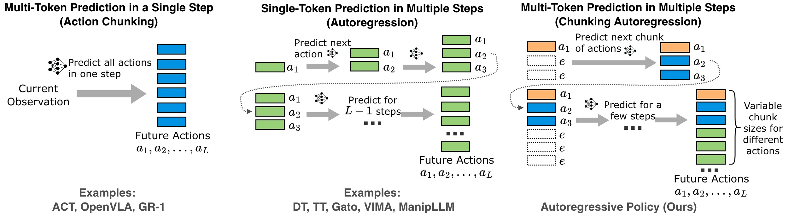
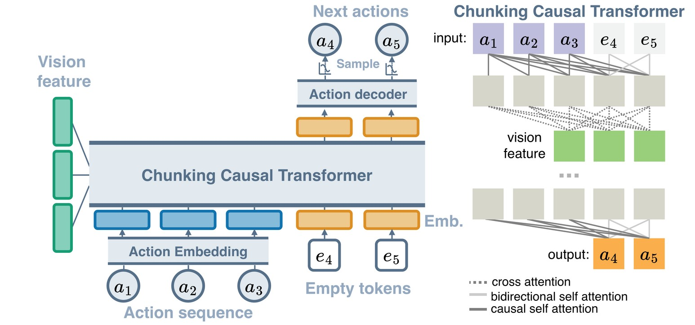

# Autoregressive Action Sequence Learning for Robotic Manipulation

[](https://arxiv.org/abs/2410.03132)  [](https://paperswithcode.com/sota/robot-manipulation-on-rlbench?autoregressive-action-sequence-learning-for)


<!--  -->


We present an imitation learning architecture based on autoregressive action sequence learning. We demonstrate strong results on Push-T, ALOHA, RLBench, and real robot experiments. For details, please check our [paper](https://arxiv.org/abs/2410.03132). 


https://github.com/user-attachments/assets/44e7eabf-dfcb-44a9-a47c-d71d653423f7


## Getting Started

To install, clone this repository and recreate the python environment according to [ENV.md](ENV.md), and download datasets and pretrained models according to [Download.md](Download.md).


- To evaluate or run demonstration with pretrained models, follow the instructions in [Eval.md](Eval.md).

- To train ARP in Push-T, ALOHA, or RLBench, follow the instructions in [Train.md](Train.md).


## More Experiments

1. To count MACs and parameters, please check [profile.ipynb](profile.ipynb). 

1. To run baselines and ablation studies, please check [Experiments.md](Experiments.md). We also provide a much cleaner implementation of RVT-2. 

2. Please check [real-robot/readme.ipynb](real-robot/readme.ipynb), if you want to learn more about the real robot experiment.

3. Visualization on Likelihood Inference and Prediction with Human Guidance. Please check [pusht/qualitative-visualize.ipynb](pusht/qualitative-visualize.ipynb). 

4. If you look for supplementary video, please check the videos folder in https://rutgers.box.com/s/uzozemx67kje58ycy3lyzf1zgddz8tyq.

5. [arp.py](arp.py) is a single-file implementation of our autoregressive policy. Directly running this file in command line will train an ARP model to generate binary mnist images. 
    - The only hairy part of the code is the `generate` function, which is, in principle simple but has some engineering details.
    - Note, action decoder (in paper) are named as predictor in this file.
    - Here are my ongoing [documentation](https://github.com/mlzxy/arp/issues/9). 

6. We provide [2d-waypoints-real-robot.ipynb](https://github.com/mlzxy/arp/blob/main/real-robot/2d-waypoints-real-robot.ipynb), which shows you how to get 2d waypoints or 2d Joint locations (which can be used as guidance for low-level actions), from URDF, camera parameters and joint positions of real robots. 


## Citation

In case this work is helpful for your research, please cite: 

```bibtex
@misc{zhang2024arp,
      title={Autoregressive Action Sequence Learning for Robotic Manipulation}, 
      author={Xinyu Zhang, Yuhan Liu, Haonan Chang, Liam Schramm, and Abdeslam Boularias},
      year={2024},
      eprint={arXiv:2410.03132},
      archivePrefix={arXiv},
      primaryClass={cs.LG},
      url={https://arxiv.org/abs/2410.03132}, 
}
```
